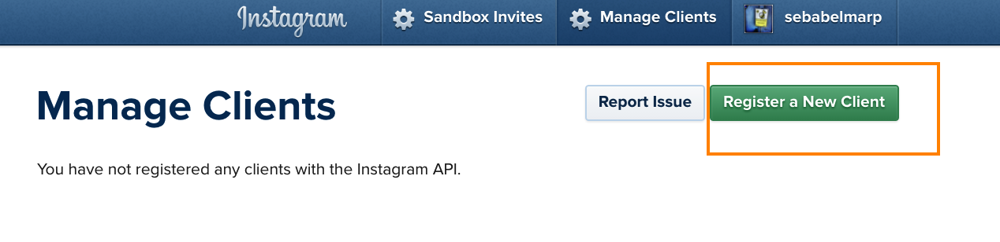
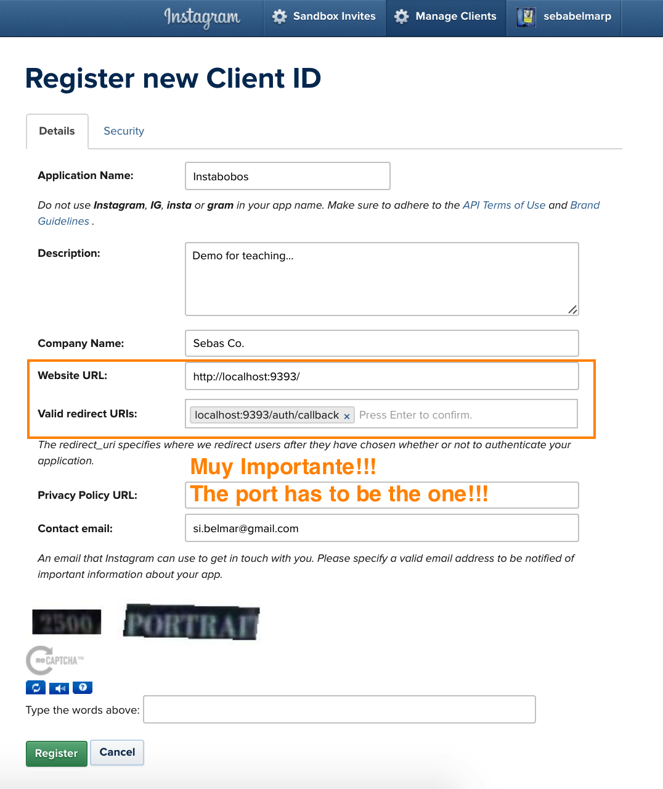
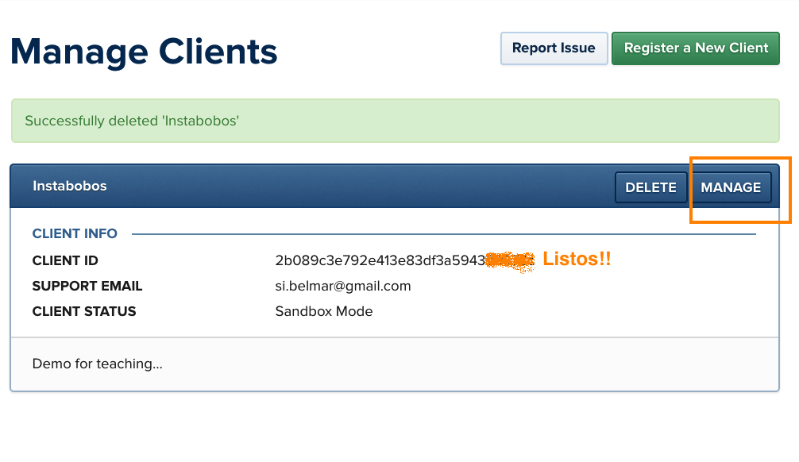
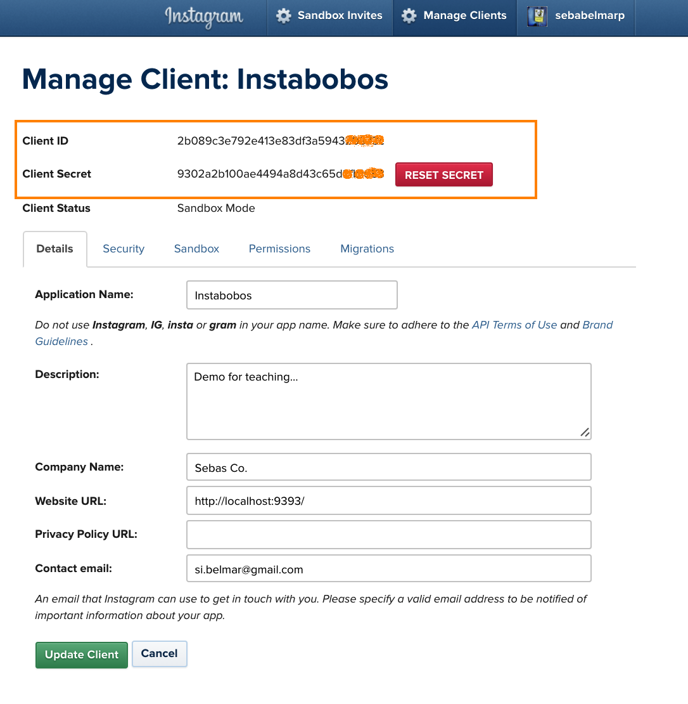
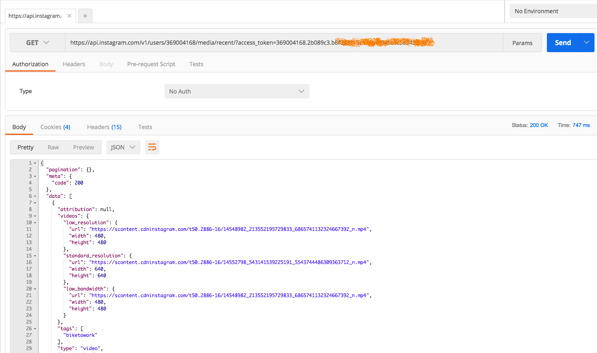

# Deconstruct some Instagram Magic

## Release 0
Follow this repos instructions to get your credentials with Instagram and add them to the project. Get the project to authenticate and consume the API. 

### Maria las llaves!! Get your keys...

[Go to the Instagram Dev site](https://www.instagram.com/developer/)


#### Go here to start the registration!


#### Register like a champ!
* Ports are important...
* Examples:
	* Website URL: `http://localhost:9393/`
	* Redirect URL: `http://localhost:9393/auth/callback`



#### Done and Manage


#### Your credentials


### In the APP
#### For now sdd your credentials to the controller app/controllers/instagram.rb:
```
  config.client_id = "2b089c3e792e413e83df3a594xxxxx"
  config.client_secret = "9302a2b100ae4494a8d43c65xxxxxx"
```  
> Ideally you put this in an .env file ;)

#### Run it
	0 bundle install
	1 Shotgun
	2 Visit '/'  
	3 Press the Instagram Logo  
	4 Authorize  
	5 PROFIT!!!  

#### And the token ???
In the servers logs (terminal)
```
"######### accsess_token ##############"
"369004168.2b089c3.b8f0a8115c144dxxxxxxx"
"--------------------------------------"
```

#### Test other Instagram Endpoints
access_token + Postman


## THE FLOW of OAuth 2.0
### Find this steps commented on app/controllers/instagram.rb

* Step 0: Provide a way to manage a ridirect to the third party login. 

* Step 1: Redirect the users to the third party Auth url. This redirect usually require send some query params to notify the third party who you are and where are you comming from.  

* Step 2: The third party service will responde back to your application to the callback URL. In this case they are responding with a code. Look the what the params have.  

* Step 3: Once you have the code. Format a Post request to get an access token and some Users information. Inspect the response out of that Post. Use this info to create a user in your DB save and the token in the sessions hash.  

* Step 4: Use the access token saved in the session hash to consume the API.

We are using the instagram gem.  

If you want to see what the gem is doing on each step:
* [Step 1](https://github.com/facebookarchive/instagram-ruby-gem/blob/master/lib/instagram/oauth.rb#L5)
* [Step 2](https://github.com/facebookarchive/instagram-ruby-gem/blob/master/lib/instagram/oauth.rb#L14)
* [Step 4](https://github.com/facebookarchive/instagram-ruby-gem/blob/master/lib/instagram/client/users.rb#L160)

## Release 1
Replace the usage of the API wrapper for your own url formating and HTTP requests using [plain vanilla ruby](https://ruby-doc.org/stdlib-2.3.1/libdoc/net/http/rdoc/Net/HTTP.html).

## Release 2
Encapsulate your interaction with the API using [HTTParty](https://github.com/jnunemaker/httparty).

## TODO:
* Add user model
* Hook MongoDB and use it somehow

